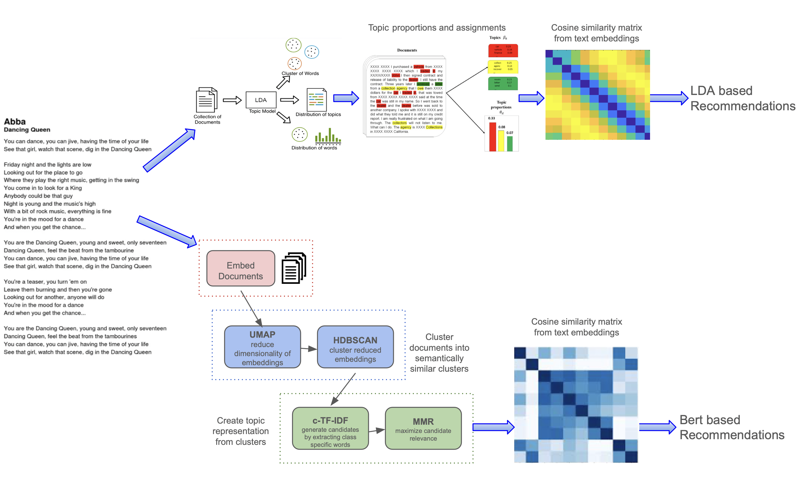

# Lyrics-Based Music Recommender System


A web-based music recommendation system that uses **song lyrics** as the primary modality to provide personalized music suggestions. The system compares three recommendation techniques: **LDA Coherent**, **LDA Fixed**, and **BERT-based models** to evaluate their performance in capturing user preferences.

## Features

- **Lyrics-Based Recommendations**: Recommends songs based on the themes and semantic of lyrics.
- **Multi-Model Comparison**: Allows users to compare recommendations from three different models: LDA Coherent, LDA Fixed, and BERT.
- **Spotify API Integration**: Enriches song data with Spotify URIs for real-time playback.
- **User Interaction**: Collects user ratings for presented songs.
- **Google Form Feedback**: Gathers user feedback for model evaluation.

## Dataset

The dataset used in this project is the spotify_millsongdata cor-
pus from https://huggingface.co/datasets/vishnupriyavr/spotify-
million-song-dataset, which contains over 57,000 entries of song
lyrics and metadata. Each entry includes the following fields:

- artist – The name of the performing artist or band (e.g.,
  ABBA).
- song – The title of the song.
- lyrics – The raw textual content of the song’s lyrics.
- id – A unique numerical identifier for each track.

## Technologies Used

### Backend:

- Python (Flask)
- Gensim (LDA topic modeling)
- BERTopic (Transformer-based topic modeling)
- UMAP (Dimensionality reduction)
- HDBSCAN (Clustering)

### Frontend:

- HTML5, CSS3, JavaScript

### Recommendation Algorithms:

- Cosine Similarity
- LDA Topic Modeling
- BERT Embeddings via Sentence Transformers

### Spotify API:

- Used to dynamically fetch Spotify track URIs.

## Installation and Setup

### Clone the Repository

```bash
git clone https://github.com/yelyzaveta-boiko/multimodal-music-recsys.git
```

### Set Up Virtual Environment

For Linux:

```bash
python3 -m venv env
source env/bin/activate
```

For Windows:

```bash
python3 -m venv env
env\Scripts\activate
```

### Install Dependencies

```bash
pip install -r requirements.txt
```

### Set Up Environment Variables

Create a `.env` file with the following:

```
SPOTIFY_CLIENT_ID=your_spotify_client_id
SPOTIFY_CLIENT_SECRET=your_spotify_client_secret
```

### Run Flask Application

```bash
python3 app.py
```

### Access Web App

```
http://127.0.0.1:5000/
```

## Project Structure

```
multimodal-music-recsys/
│
├── bert_model/                   # Precomputed BERT files
│   ├── all-mpnet-base-v2.npy
│   ├── lyrics_df.pkl
│   └── lyrics-bert.npy
│
├── data/                         # Raw datasets
│   ├── spotify_millsongdata.csv
│   └── spotify_millsongdata_en.csv
│
├── lda_model_coh/                # LDA Coherent model files
│   ├── lda_lyrics.model
│   ├── lda_vectors.npy
│   └── lyrics_dictionary.dict
│
├── lda_model_fixed/              # LDA Fixed model files
│   ├── lda_lyrics.model
│   ├── lda_vectors.npy
│   └── lyrics_dictionary.dict
│
├── topic_models/                 # Jupyter notebooks
│   ├── bert_model.ipynb
│   ├── BERTopics.ipynb
│   ├── build_lda_coh.ipynb
│   ├── build_lda_exp.ipynb
│   ├── recommend_lda_coh.ipynb
│   ├── embeddings.npy
│   └── en_lyrics_filtering.ipynb│
│
│
├── backend/                      # Flask backend
│   ├── app.py                    # Main Flask application
│   ├── recommendation.py         # Multi-model recommendation logic
│   ├── spotify_api.py            # Spotify API integration
│   ├── topic_models.py           # Topic model loading and utilities
│
├── frontend/                     # Frontend components
│   ├── static/
│   │   ├── style.css
│   │   └── script.js
│   ├── templates/
│   │   └── index.html            # Webpage layout
│
├── assets/                       # Pipeline diagram
│   └── pipeline.png
│
├── venv/                         # Virtual environment
├── requirements.txt              # Python dependencies
├── README.md                     # Project documentation
├── .env                          # Spotify API credentials
└── .gitignore                    # Git ignored files

```

## Usage Instructions

1. **Rate Songs**: The app will display 5 random songs. Rate each song based on your preference.
2. **Select Recommendation Model**: Choose LDA Coherent, LDA Fixed, or BERT-based model to receive personalized recommendations.
3. **View Recommendations**: Based on your selected model and ratings, new songs will be suggested.
4. **Play Songs**: Spotify embeds allow real-time playback of recommended tracks.
5. **Provide Feedback**: Use the embedded Google Form to evaluate the system.

## How It Works

- **Lyrics Preprocessing**: Songs are cleaned, tokenized, and embedded using both LDA and BERT models.
- **Model Selection**: Users can test all three models to compare their effectiveness.
- **Similarity Matching**: Cosine similarity is applied to song vectors to generate personalized recommendations.
- **Real-Time Spotify Integration**: The app dynamically fetches song URIs for playback.

## Future Enhancements

- **Multilingual Expansion**: Integrate multiple languages to broaden the recommendation base.
- **Multimodal Fusion**: Combine lyrics with audio features using contrastive learning.
- **Collaborative Filtering**: Incorporate user history and otgher people ratings to further personalize recommendations.
